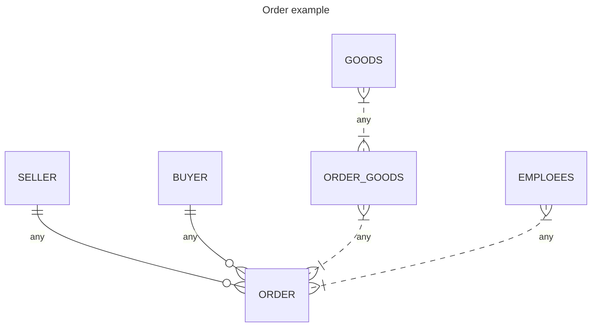

# Товарная накладная


## Схема базы данных


## Реализация API
### CRUD товаров
|verb|url|description|request|response|codes|
|-|-|-|-|-|-|
|GET|api/goods/|Получает список всех товаров| | `[goodApiModel]` | 200 OK |
|GET|api/goods/{id}|Получает товар с идентификатором id | fromRoute: id | `goodApiModel` | 200 OK<br/>404 NotFound |
|POST|api/goods/|Добавляет новый товар| fromBody: `goodRequestApiModel` | `goodApiModel` | 200 OK |
|PUT|api/goods/{id}|Редактируем товар с идентификатором id| fromRoute: id <br/>fromBody: `goodRequestApiModel` | `goodApiModel` | 200 OK<br/>404 NotFound |
|DELETE|api/goods/{id}|Удаляет товар с идентификатором id | fromRoute: id | | 200 OK<br/>404 NotFound |


```javascript
// goodItem
{
  id: 1,
  name: "Товар 1",
  description: "описание товара 1"
}
```
```javascript

// goodRequestApiModel
{
  name: "Товар 1",
  description: "описание товара 1"
}
```
