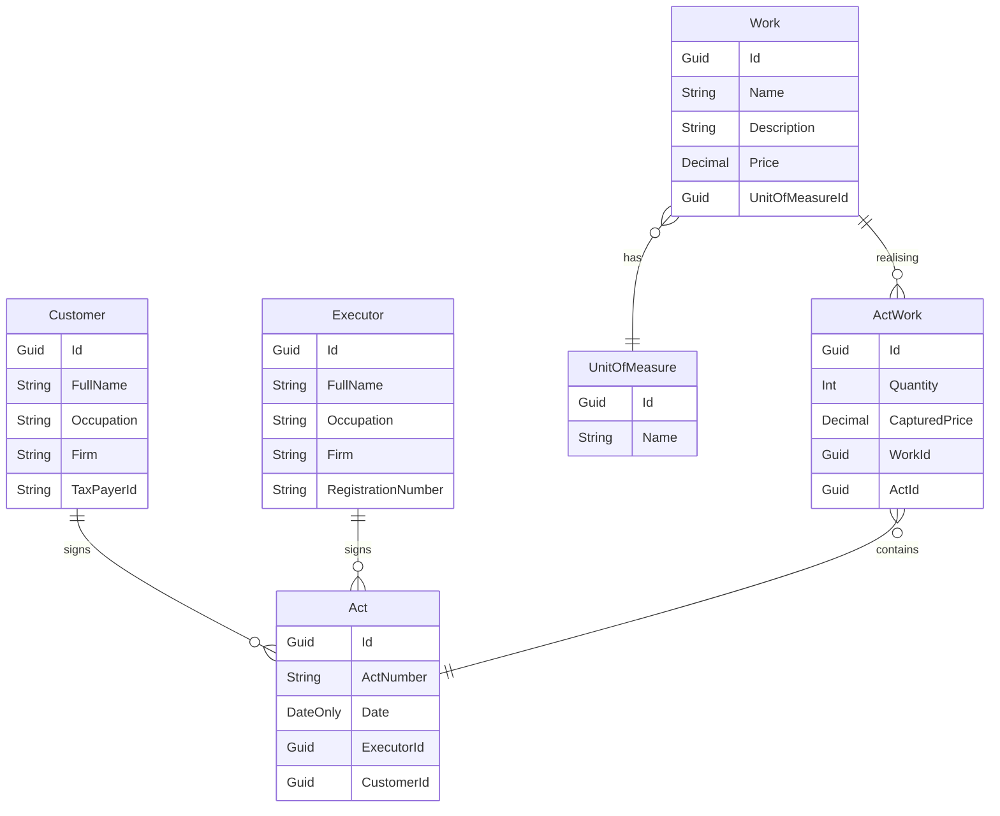

# Акт сдачи-приёмки выполненных работ


## Схема базы данных


## Реализация API
### CRUD единиц измерения
|verb|url|description|request|response|codes|
|-|-|-|-|-|-|
|GET|Api/UnitOfMeasure/|Получает единицу измерения всех работ| | `[UnitOfMeasureApiModel]` | 200 OK |
|GET|Api/UnitOfMeasure/{id}|Получает единицу измерения по идентификатору id | fromRoute: id | `UnitOfMeasureApiModel` | 200 OK<br/>404 NotFound |
|POST|Api/UnitOfMeasure/|Добавляет новую единицу измерения| fromBody: `UnitOfMeasureCreateRequestApiModel` | `UnitOfMeasureApiModel` | 200 OK<br/>409 Conflict<br/>422 UnprocessableEntity |
|PUT|Api/UnitOfMeasure/{id}|Редактирует единицу измерения по идентификатору id| fromRoute: id <br/>fromBody: `UnitOfMeasureCreateRequestApiModel` | `UnitOfMeasureApiModel` | 200 OK<br/>409 Conflict<br/>404 NotFound<br/>422 UnprocessableEntity  |
|DELETE|Api/UnitOfMeasure/{id}|Удаляет единицу измерения по идентификатору id | fromRoute: id | | 200 OK<br/>404 NotFound |


```javascript
// UnitOfMeasureApiModel
{
  Id: c2331ea8-a98d-ac3e-baea-d88f5665947,
  Name: "кг."
}
```
```javascript

// UnitOfMeasureCreateRequestApiModel
{
  Name: "кг."
}
```

### CRUD работ
|verb|url|description|request|response|codes|
|-|-|-|-|-|-|
|GET|Api/Works/|Получает список всех работ| | `[WorkApiModel]` | 200 OK |
|GET|Api/Works/{id}|Получает работу по идентификатору id | fromRoute: id | `WorkApiModel` | 200 OK<br/>404 NotFound |
|POST|Api/Works/|Добавляет новую работу| fromBody: `WorkCreateRequestApiModel` | `WorkApiModel` | 200 OK<br/>409 Conflict<br/>422 UnprocessableEntity |
|PUT|Api/Works/{id}|Редактирует работу по идентификатору id| fromRoute: id <br/>fromBody: `WorkCreateRequestApiModel` | `WorkApiModel` | 200 OK<br/>409 Conflict<br/>404 NotFound<br/>422 UnprocessableEntity  |
|DELETE|Api/Works/{id}|Удаляет работу по идентификатору id | fromRoute: id | | 200 OK<br/>404 NotFound |


```javascript
// WorkApiModel
{
  Id: c2331ea8-a98d-ac3e-baea-d88f5665947,
  Name: "Работа 1",
  Description: "описание работы 1",
  Price: 10000,
  UnitOfMeasure: {
    Id: c2331ea8-a98d-ac3e-baea-d88f5665947,
    Name: "кг."
  }
}
```
```javascript

// WorkCreateRequestApiModel
{
  Name: "Работа 1",
  Description: "описание работы 1",
  Price: 10000,
  UnitOfMeasureId: c2331ea8-a98d-ac3e-baea-d88f5665947
}
```

### CRUD исполнителей
|verb|url|description|request|response|codes|
|-|-|-|-|-|-|
|GET|Api/Executor/|Получает список всех исполнителей| | `[ExecutorApiModel]` | 200 OK |
|GET|Api/Executor/{id}|Получает исполнителя по идентификатору id | fromRoute: id | `ExecutorApiModel` | 200 OK<br/>404 NotFound |
|POST|Api/Executor/|Добавляет нового исполнителя| fromBody: `ExecutorCreateRequestApiModel` | `ExecutorApiModel` | 200 OK<br/>409 Conflict<br/>422 UnprocessableEntity |
|PUT|Api/Executor/{id}|Редактирует исполнителя по идентификатору id| fromRoute: id <br/>fromBody: `ExecutorCreateRequestApiModel` | `ExecutorApiModel` | 200 OK<br/>409 Conflict<br/>404 NotFound<br/>422 UnprocessableEntity  |
|DELETE|Api/Executor/{id}|Удаляет исполнителя по идентификатору id | fromRoute: id | | 200 OK<br/>404 NotFound |


```javascript
// ExecutorApiModel
{
  Id: c2331ea8-a98d-ac3e-baea-d88f5665947,
  FullName: "ФИО исполнителя",
  Occupation: "Работа исполнителя",
  Firm: "ООО Фирма исполнителя",
  RegistrationNumber: "1234567890123"
}
```
```javascript

// ExecutorCreateRequestApiModel
{
  FullName: "ФИО исполнителя",
  Occupation: "Работа исполнителя",
  Firm: "ООО Фирма исполнителя",
  RegistrationNumber: "1234567890123"
}
```


### CRUD заказчиков
|verb|url|description|request|response|codes|
|-|-|-|-|-|-|
|GET|Api/Customer/|Получает список всех заказчиков| | `[CustomerApiModel]` | 200 OK |
|GET|Api/Customer/{id}|Получает заказчика по идентификатору id | fromRoute: id | `CustomerApiModel` | 200 OK<br/>404 NotFound |
|POST|Api/Customer/|Добавляет нового заказчика| fromBody: `CustomerCreateRequestApiModel` | `CustomerApiModel` | 200 OK<br/>409 Conflict<br/>422 UnprocessableEntity |
|PUT|Api/Customer/{id}|Редактирует заказчика по идентификатору id| fromRoute: id <br/>fromBody: `CustomerCreateRequestApiModel` | `CustomerApiModel` | 200 OK<br/>409 Conflict<br/>404 NotFound<br/>422 UnprocessableEntity  |
|DELETE|Api/Customer/{id}|Удаляет заказчика по идентификатору id | fromRoute: id | | 200 OK<br/>404 NotFound |


```javascript
// CustomerApiModel
{
  Id: c2331ea8-a98d-ac3e-baea-d88f5665947,
  FullName: "ФИО заказчика",
  Occupation: "Работа заказчика",
  Firm: "ООО Фирма заказчика",
  TaxPayerId: "123456789012"
}
```
```javascript

// CustomerCreateRequestApiModel
{
  FullName: "ФИО заказчика",
  Occupation: "Работа заказчика",
  Firm: "ООО Фирма заказчика",
  TaxPayerId: "123456789012"
}
```


### CRUD актов
|verb|url|description|request|response|codes|
|-|-|-|-|-|-|
|GET|Api/Act/|Получает список всех актов| | `[ActApiModel]` | 200 OK |
|GET|Api/Act/{id}|Получает акт по идентификатору id | fromRoute: id | `ActApiModel` | 200 OK<br/>404 NotFound |
|GET|Api/Act/{id}/export| Экспортирует акт по идентификатору id | fromRoute: id | File .xlsx | 200 OK<br/>404 NotFound |
|POST|Api/Act/|Добавляет новый акт| fromBody: `ActCreateRequestApiModel` | `ActApiModel` | 200 OK<br/>409 Conflict<br/>422 UnprocessableEntity<br/>409 Conflict |
|PUT|Api/Act/{id}|Редактирует акт по идентификатору id| fromRoute: id <br/>fromBody: `ActCreateRequestApiModel` | `ActApiModel` | 200 OK<br/>409 Conflict<br/>404 NotFound<br/>422 UnprocessableEntity<br/>409 Conflict  |
|DELETE|Api/Act/{id}|Удаляет акт по идентификатору id | fromRoute: id | | 200 OK<br/>404 NotFound |


```javascript
// ActApiModel
{
  Id: c2331ea8-a98d-ac3e-baea-d88f5665947,
  ActNumber: "120019",
  Date: "2025-07-18",
  Executor: {
    Id: c2331ea8-a98d-ac3e-baea-d88f5665947,
    FullName: "ФИО исполнителя",
    Occupation: "Работа исполнителя",
    Firm: "ООО Фирма исполнителя",
    RegistrationNumber: "1234567890123",
  },
  Customer: {
    Id: c2331ea8-a98d-ac3e-baea-d88f5665947,
    FullName: "ФИО заказчика",
    Occupation: "Работа заказчика",
    Firm: "ООО Фирма заказчика",
    TaxPayerId: "123456789012",
  },
  ActWorks: [
    {
      Quantity: 10,
      CapturedPrice: 10000,
      Work: {
        Id: c2331ea8-a98d-ac3e-baea-d88f5665947,
        Name: "Работа 1",
        Description: "описание работы 1",
        Price: 10000,
        UnitOfMeasure: {
          Id: c2331ea8-a98d-ac3e-baea-d88f5665947,
          Name: "кг."
        }
      }
    }
  ],
}
```
```javascript

// ActCreateRequestApiModel
{
  ActNumber: "120019",
  Date: "2025-07-18",
  ExecutorId: c2331ea8-a98d-ac3e-baea-d88f5665947,
  CustomerId: c2331ea8-a98d-ac3e-baea-d88f5665947,
  Works: [
    {
      WorkId: c2331ea8-a98d-ac3e-baea-d88f5665947,
      Quantity: 10,
    }
  ],
}
```
```javascript
// ActWorksApiModel
{
  Quantity: 10,
  CapturedPrice: 10000,
  Work: {
    Id: c2331ea8-a98d-ac3e-baea-d88f5665947,
    Name: "Работа 1",
    Description: "описание работы 1",
    Price: 10000,
    UnitOfMeasure: {
      Id: c2331ea8-a98d-ac3e-baea-d88f5665947,
      Name: "кг."
    }
  }
}
```
```javascript

// ActWorksCreateRequestApiModel
{
  Quantity: 10,
  WorkId: c2331ea8-a98d-ac3e-baea-d88f5665947,
}
```